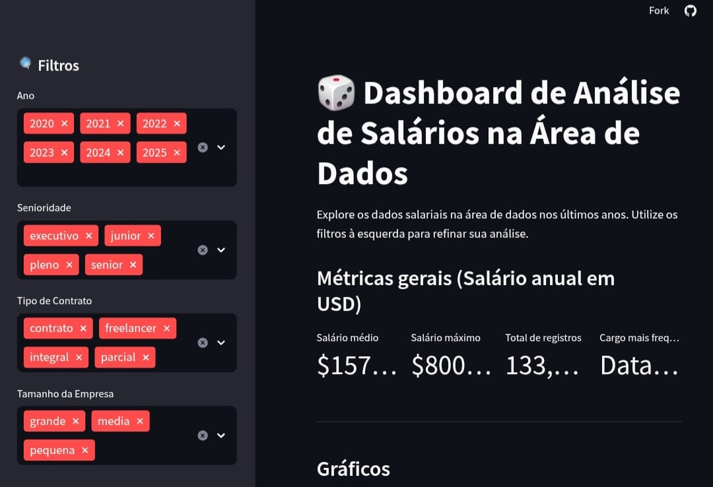
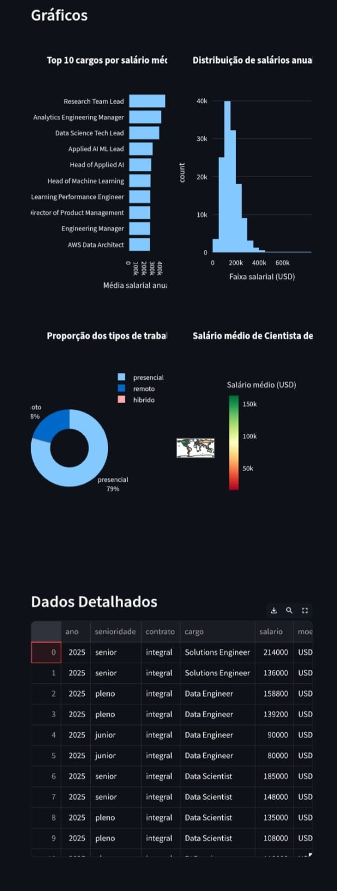

📊 Imersão Dados com Python – Dashboard de Salários

Projeto desenvolvido durante a **Imersão Dados com Python (Alura)**, cobrindo todas as etapas do fluxo de trabalho de um Analista de Dados — desde a análise exploratória até a criação de um dashboard interativo.

🚀 Visão Geral
O objetivo foi transformar um dataset de salários na área de dados em uma ferramenta visual e dinâmica para explorar tendências, comparações e distribuições salariais.  
O projeto foi dividido em duas etapas principais:

1. **Análise Exploratória e Limpeza de Dados**  
   - Carregamento do dataset de salários.
   - Padronização de nomes de colunas.
   - Tratamento de valores ausentes.
   - Criação de categorias para variáveis.
   - Geração de visualizações iniciais.

2. **Desenvolvimento do Dashboard Interativo**  
   - Construído com **Streamlit**.
   - Filtros dinâmicos e indicadores (KPIs) principais.
   - Gráficos e mapas interativos.
   - Experiência responsiva e de fácil navegação.

🛠 Tecnologias e Bibliotecas Utilizadas
- **Python** – Linguagem principal de desenvolvimento.
- **Pandas** – Manipulação e análise de dados.
- **Seaborn** e **Plotly Express** – Visualizações interativas.
- **Streamlit** – Construção da aplicação web.
- **Pycountry** – Enriquecimento geográfico dos dados.
- **Jupyter Notebook** – Ambiente de análise exploratória.
- **VSCode** – Ambiente de desenvolvimento.

📌 Principais Funcionalidades do Dashboard
- **Crescimento Salarial**: Média salarial por nível de carreira (Júnior, Pleno, Sênior, Executivo).  
- **Modalidade de Trabalho**: Proporção entre cargos presenciais, remotos e híbridos.  
- **Distribuição Geográfica**: Mapa-múndi interativo com a média salarial por país.

📷 Capturas de Tela do Dashboard

### Tela Inicial e Filtros

### Visualizações e Dados Detalhados

## 📂 Estrutura do Repositório
- **`notebooks/`** – Análises exploratórias e tratamento dos dados.
- **`app.py`** – Código principal do Streamlit.
- **`dados-processados.csv`** – Dataset final, pronto para consumo no dashboard.
- **`img/`** – Pasta com capturas de tela do dashboard.

## 🌐 Acesse o Dashboard Online
🔗 [https://imers-dados-python-alura-2025.streamlit.app/](https://imers-dados-python-alura-2025.streamlit.app/)
